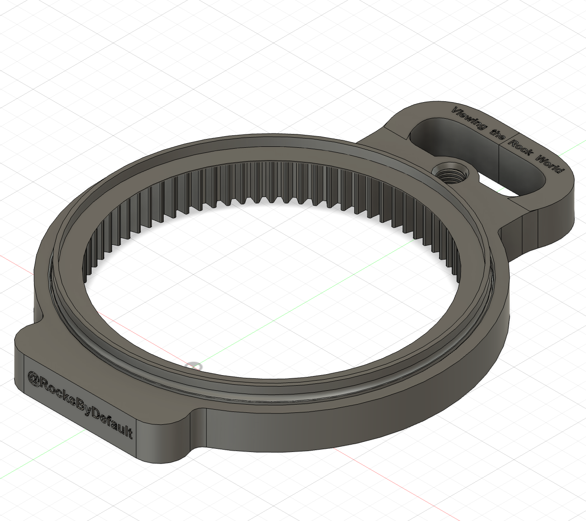
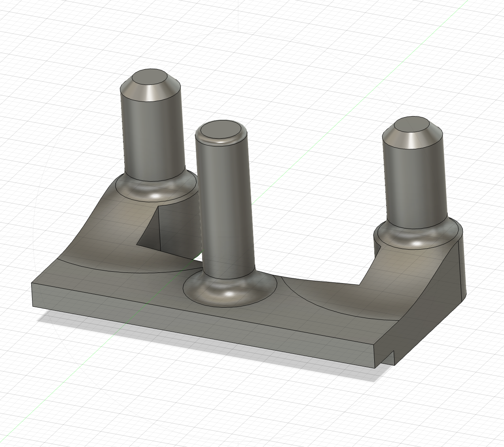
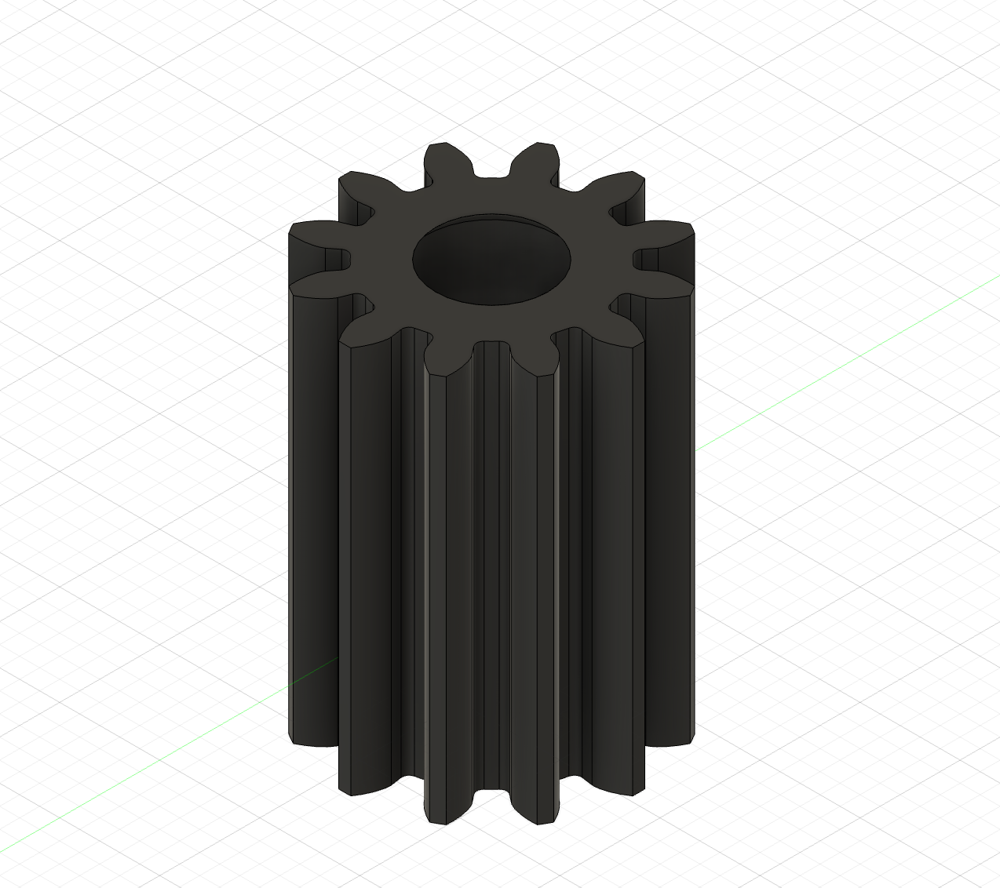
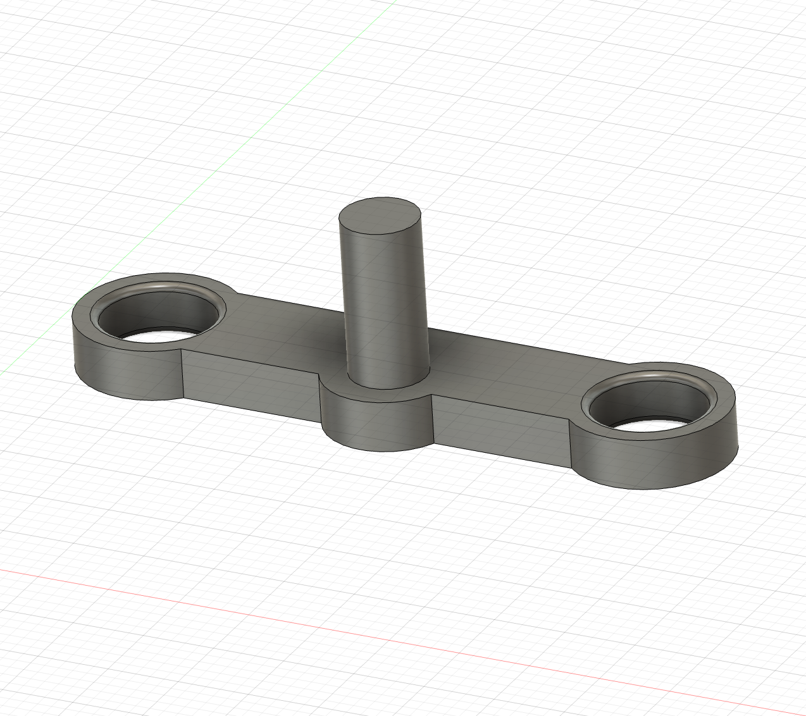
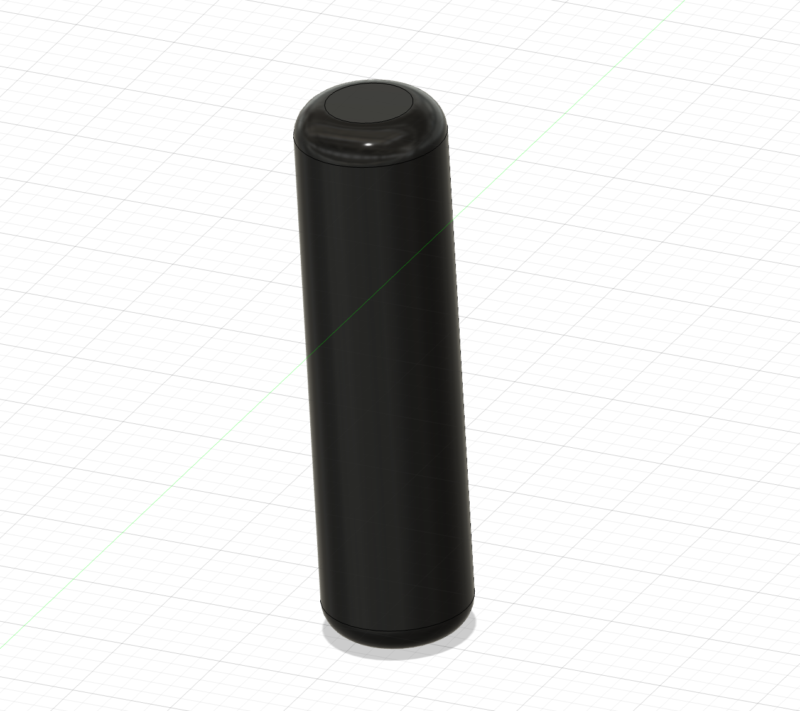
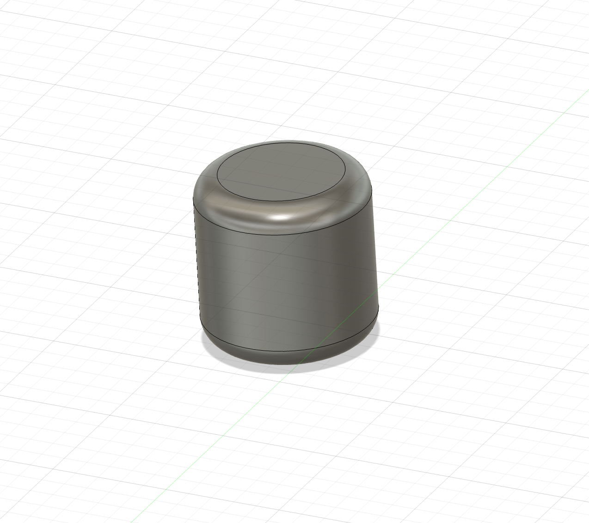
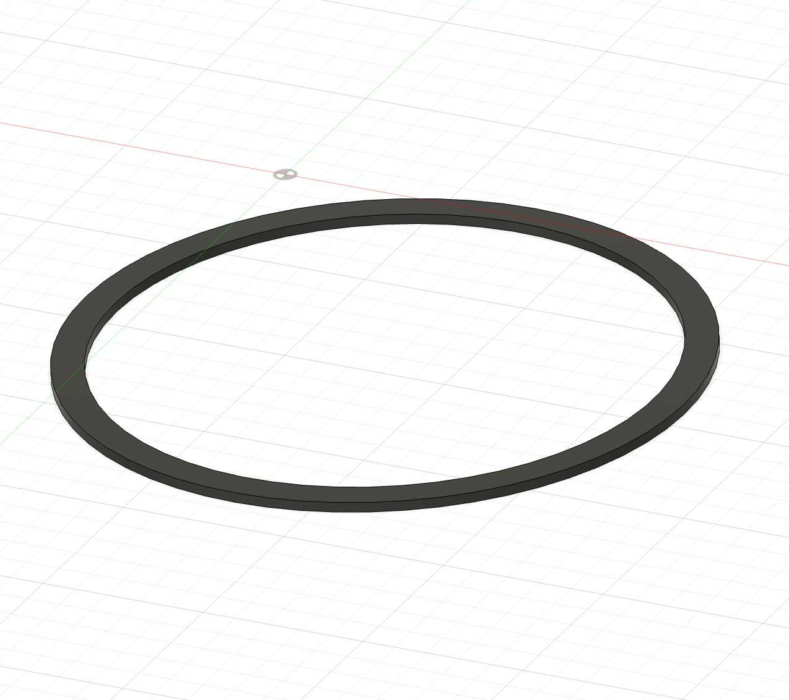
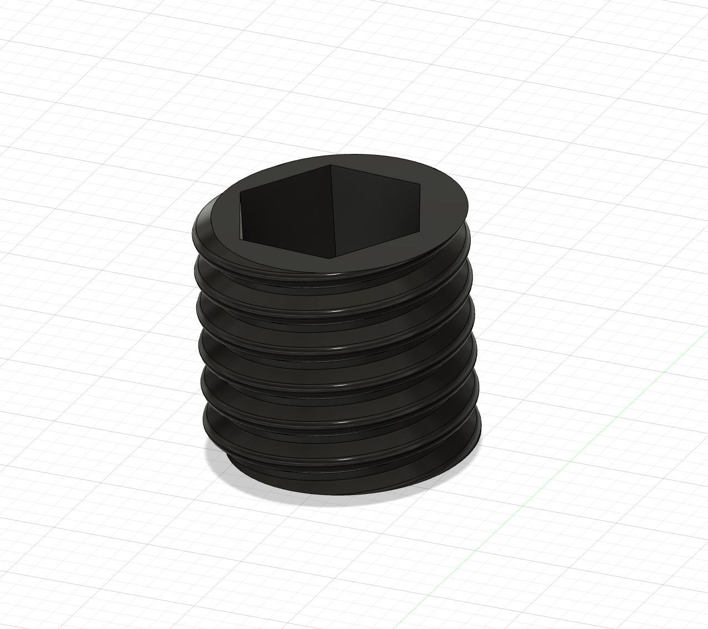
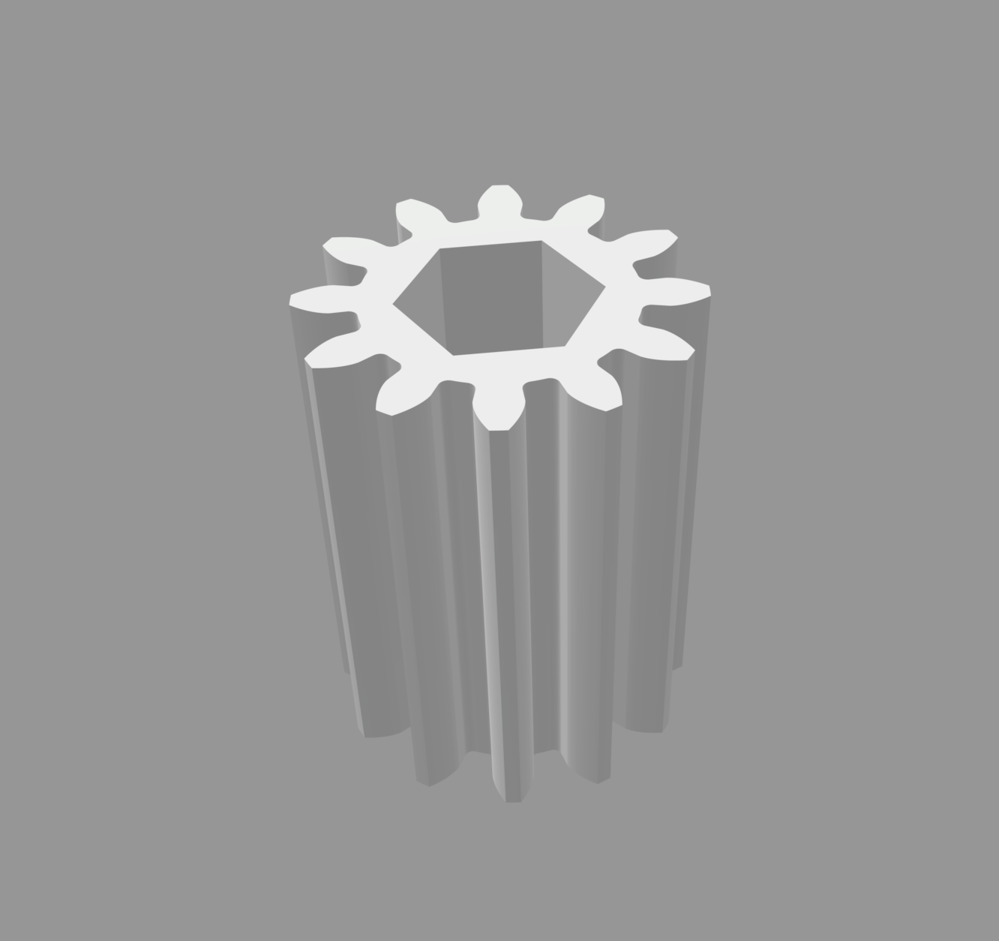
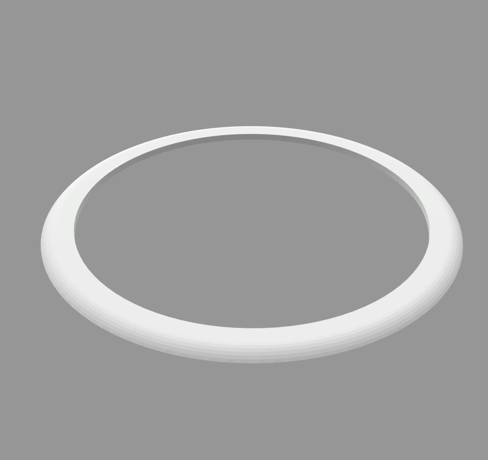

All the components for the thin section viewer can easily be printed on an entry level 3D printer. Three of the components require supports: the two 'follow brackets' and the 'main drive bracket'. 

Although is my first foray into 3D printing, if you run into any problems printing the parts, I might be able to help you troubleshoot them.

{}Download the .STL files{}

Here are all the 3D printed parts you will need to build the slide viewer. 

  

    
    
Ring gear (x2)

  

  

    
    
Turn gear

  

  

    
    
Main drive bracket

  

  

    
    
Main drive gear

  

  

    
    
Follow bracket (x2)

  

  

    
    
Follow gear (x2)

  

  

    
    
Central follow gear holder (x2)

  

  

    
    
Central follow gear

  

  

    
    
Support post (x2)

  

  

    
    
Connector post (2)

  

  

    
    
Polariser ring (x2)

  

  

    
    
Grub screw (x2)

  

In addition to these parts, you will also find 2 tools, a drive gear with a hex bit hole and a template to cut out the polarisers:

  

    
    
Hex drive gear

  

  

    
    
Polariser template

  

Once you've printed everything, all that remains is to [assemble the viewer!](https://matthewtarling.github.io/outreach/assembly/)

<video id="myVideo" src="printing.mp4" title="Title" autoplay loop></video>

