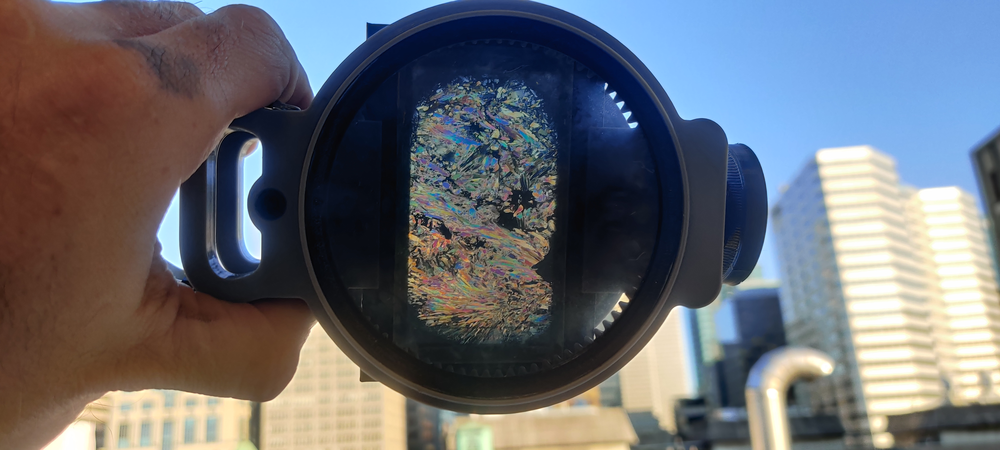

Welcome to the *Viewing the Rock World* outreach project!

*Viewing the Rock World* is based on a 3D printed thin section viewer that can easily be made by anyone with a 3D printer for under $5CAD. On these pages, you will find all the information relating to the project and how you can be a part of it.

In this first phase of the project, I am looking for groups that are interested in 3D printing the slide viewer and receiving a traveling collection of thin sections and brief accompanying educational materials. I'm also looking for 3D-printing enthusiasts who might be interested in printing the thin section viewer for a school or group, as well as researcher who might be interested in donating thin sections or exceptional rocks to the traveling collections.  [Find out more here](https://matthewtarling.github.io/outreach/getinvolved/)

As this project develops, I will create more content and fill out these pages. If you have any questions or need help, don't hesitate to reach out! 

Check out the project's [YouTube channel](https://www.youtube.com/channel/UC3MrJA-ePO3diRNhOkEdeag) for instructions and additional information. 

<video id="myVideo" src="slideviewshort.mp4" title="Title" autoplay loop></video>

