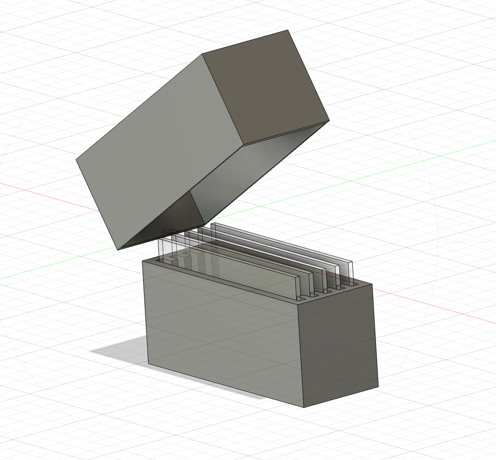
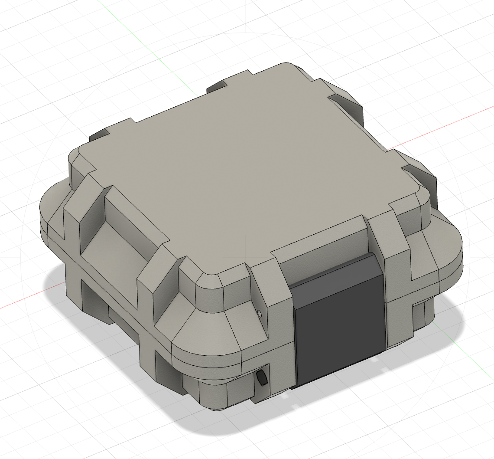
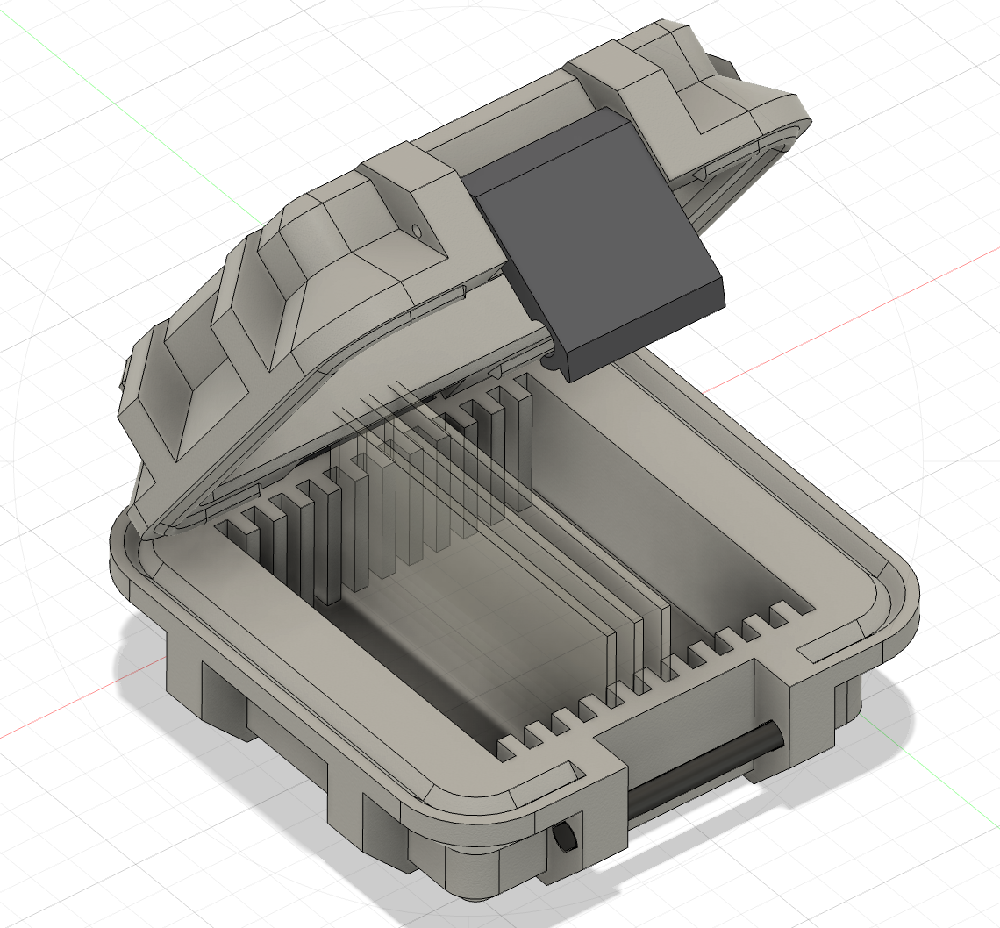
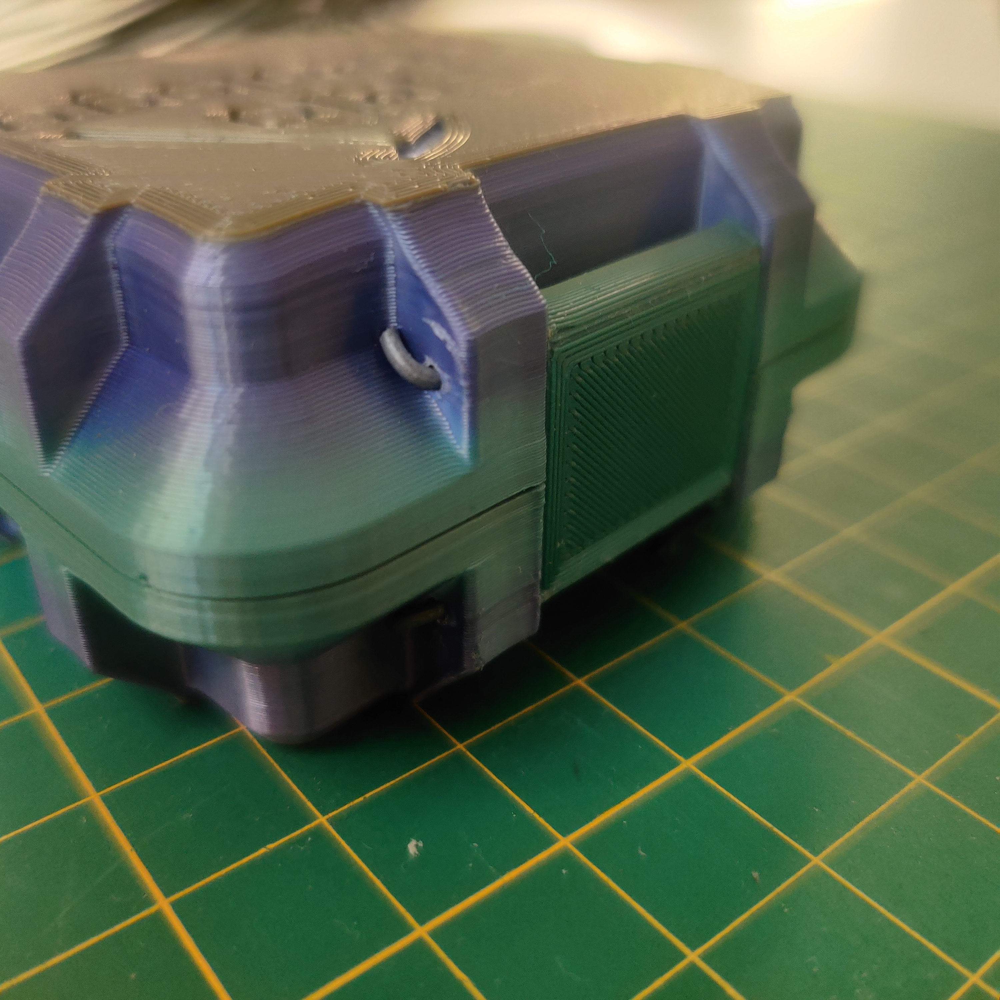
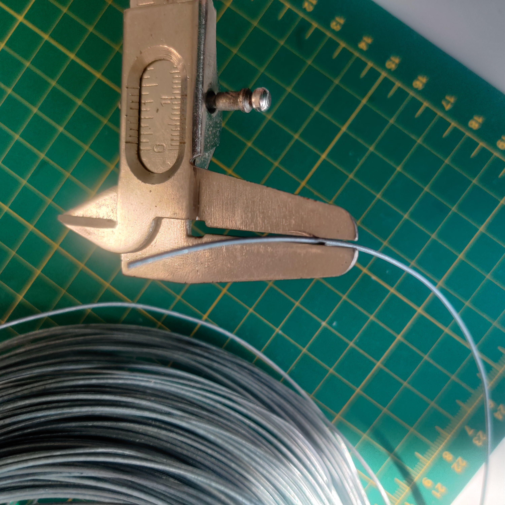
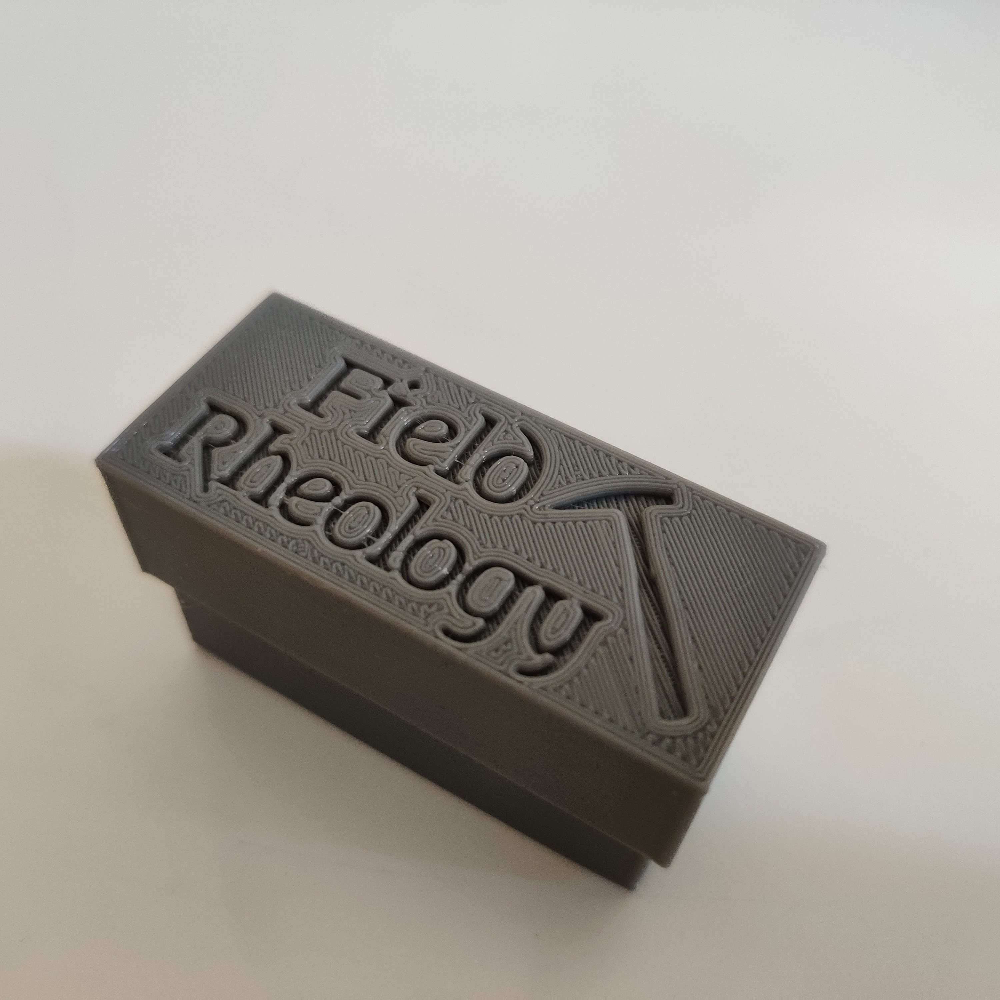
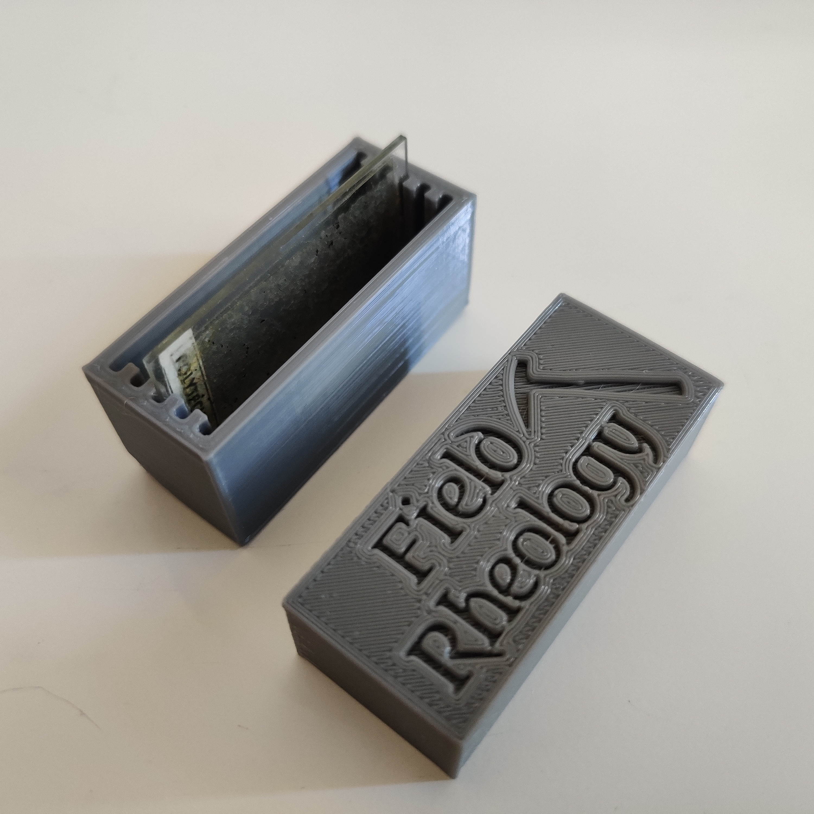

I designed 3D-printable thin section boxes after the McGill University [Field Rheology Rowe Research Group](https://www.eps.mcgill.ca/~crowe/) expressed interest in having some made. There are several models available, from a simple box that holds 5 thin sections with a friction-fit lid, to more intricate boxes based on a design of a hinged box with a clasp that you can find [here](https://www.printables.com/model/540605-parametric-box-v2-single-clasp). All boxes were designed for printing with PLA filament. 

I provide all the .STL files for these boxes below for *free*. If you feel inclined, you can show your appreciation by donating to support the [*Viewing the Rock World* outreach project](https://matthewtarling.github.io/outreach).

For a donation of $30CAD to [*Viewing the Rock World*](https://matthewtarling.github.io/outreach), I will design a custom branded box for you with a name or logo of your choosing embossed into the lid for you to print! See [below](#section-4) for examples and more details. Reach out to me if you would like a design for a custom branded box or one made for a different capacity or slide size, and we can discuss the details.

If you print one of these boxes, please send me pictures, and I will add it to a gallery at the end of this page!

 

<!-- Table of Contents -->

- [Simple friction fit box - 5 slides](#section-1)
- [Hinged box - 12 slides](#section-2)
- [Hinged box - 24 slides](#section-3)
- [Customized slides boxes](#section-4)
- [Image Gallery](#section-gallery)

 

  

## Simple friction fit box - 5 slides

A simple box with a friction-fit slide lid. This design fits both 27x46mm and 28x48 mm glass slides.

Download the .STL files here. 

  

    
    
Design for the 5 slide friction fit box

  

  

    
    
Caption for Image 2

  

## Hinged box - 12 slides

This design fits both 27x46mm and 28x48 mm slides. Metal wire is needed to fix the hinge and clasp in place. I use 1.1 mm galvanised steel wire, but you could use any sort of bendable wire from 0.75 mm to 2 mm. If you have some other sort of wire on hand that is outside that range, drop me a line and I'll see if I can make it work for you. ([Number 8 Wire](https://en.wikipedia.org/wiki/Number_8_wire) might be borderline, but I could probably make it work.)

Download the .STL files here. 

  

    
    
Caption for Image 1

  

  

    
    
Caption for Image 2

  

  

    
    
Caption for Image 3

  

  

    
    
Caption for Image 4

  

## Hinged box - 24 slides

This design fits both 27x46mm and 28x48 mm slides. Like the 12 slide box above, it requires wire to fix the hinges and clasps in place. 

Download the .STL files here. 

## Customised slides boxes

To have a design for a custom branded thin section box made, send me your logo as a vector file. For best results, the design needs to be very simple and the smallest features should be >2 mm. The simplest way for me to incorporate your design is to emboss it on the top, but I'm open to trying other ways. Here are some examples:

<!-- Gallery section -->

<!-- Add your gallery images below -->

  

    
    
Field Rheology research group branded box

  

  

    
    
Field Rheology research group branded box

  

