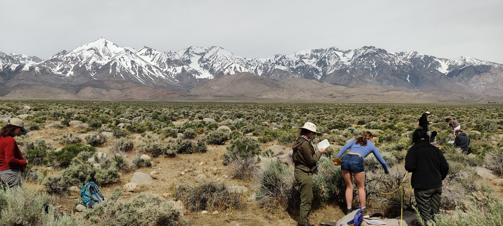
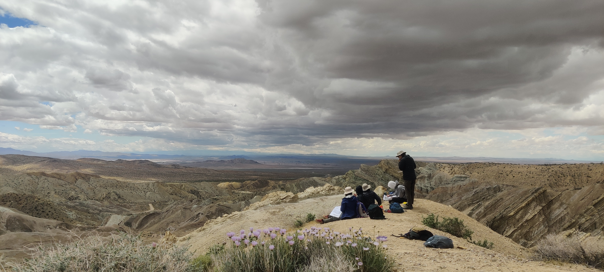
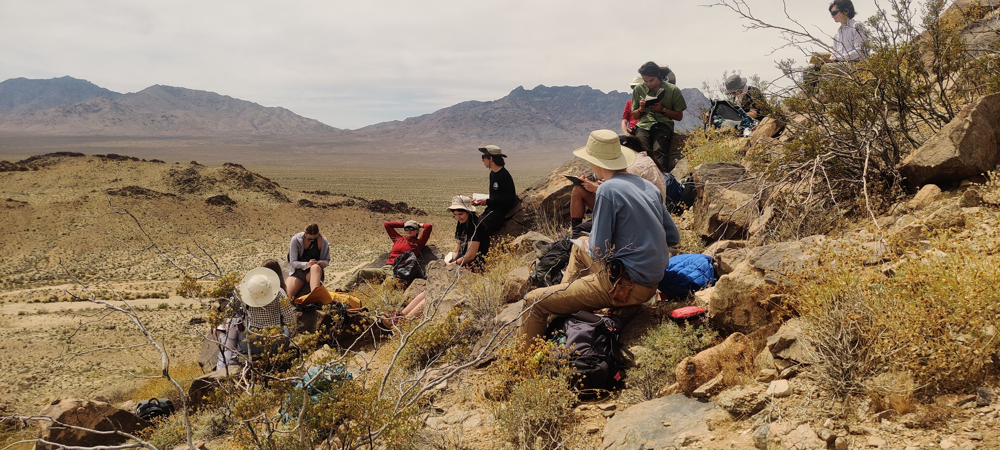
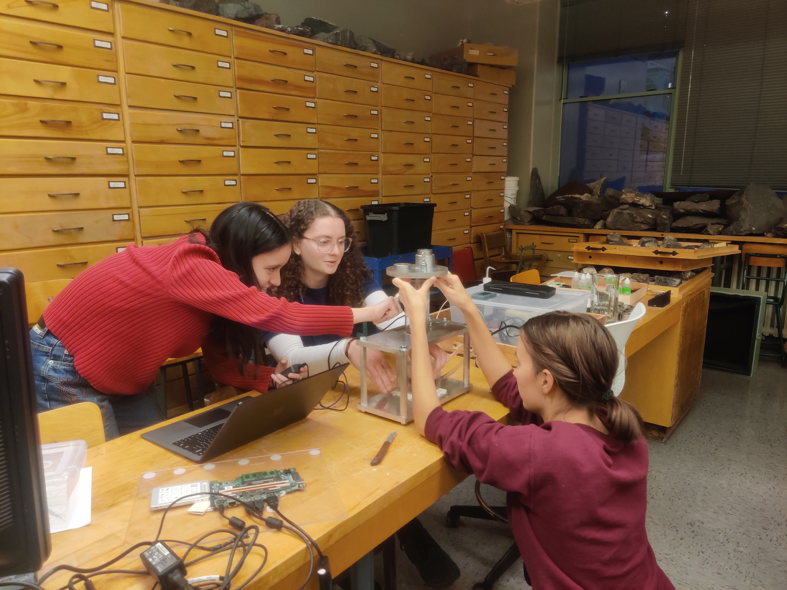

  
  
  
  

Courses Taught

1. **EPSC303 Structural Geology**

Third year structural geology course. Designed and taught lectures with regular hands-on exercises, designed new student-lead laboratory experiments and led field trips to promote experiential learning. Top rated course in the EPS Department in student course evaluations for Fall 2022

 

2. **EPSC231 Field School I**

Introductory field mapping course. Led 2 week undergraduate field course in Nevada and California designed to introduce students to geological field mapping of tectonically deformed landscapes.

McGill EPSC303 Structural geology Fall 2022 students Dana Marino, Abbi Baran, and 
Clara Schryer 

<video src="Prada.mp4" controls title="Title"></video>

